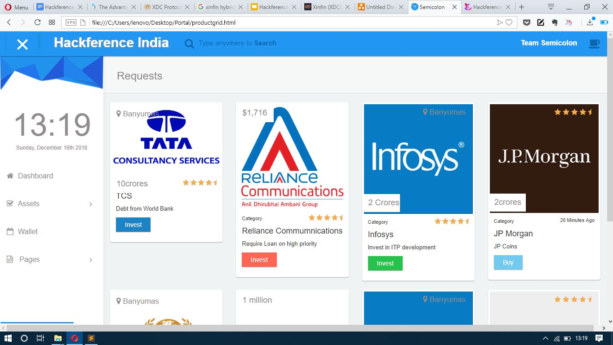
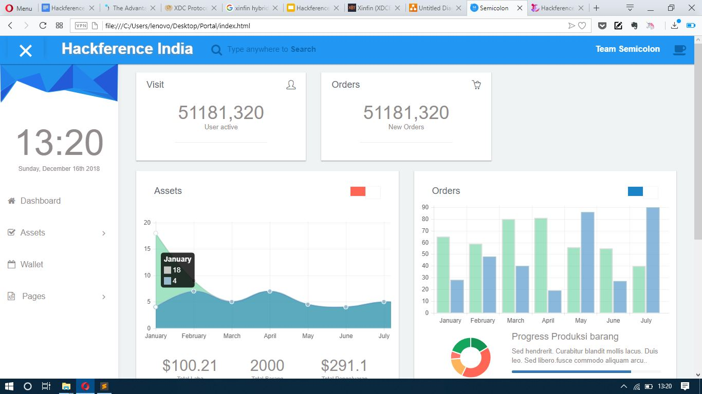

# Debt Syndication

Simplifying Huge Loan process and risk reduction - Hackference Hackathon 2018

## Introduction
Debt Remittance is currently a cumbersome process that requires days to validate and verify transactions amongst the involved parties. Our platform solves issues in the present day debt syndication process by using a hybrid blockchain network. It has following advantages: Faster  Liquidity , Secure Anonymity, Improved efficiency and trust. Smart contract driven approach .It comprises of a public investment/ loan request portal where the users can lend or borrow variable amount based upon availability and requirements.

## Features:

* Transparency
* Faster Liquidity
* Process huge loans
* Reduced risks and damages to banks by defaulter
* Transaction Efficiency
* Real-time Transactions and ledger

## Video Demo:

[Watch the video](https://drive.google.com/file/d/16s3O91uQQqMBbdAQd3gGbVvEx5zw1G3_)

## Tech-Stack and Tools:

* Solidity
* Ethereum Blockchain
* Web3
* Truffle
* HTML, CSS, Javascript, jQuery

## Credits :
Team Semicolon :
* [Ronak Doshi](https://www.github.com/Ronak-59)
* [Tito Nadar](https://www.github.com/TitoNadar)
* [Devansh Shah](https://www.github.com/dnssh)

